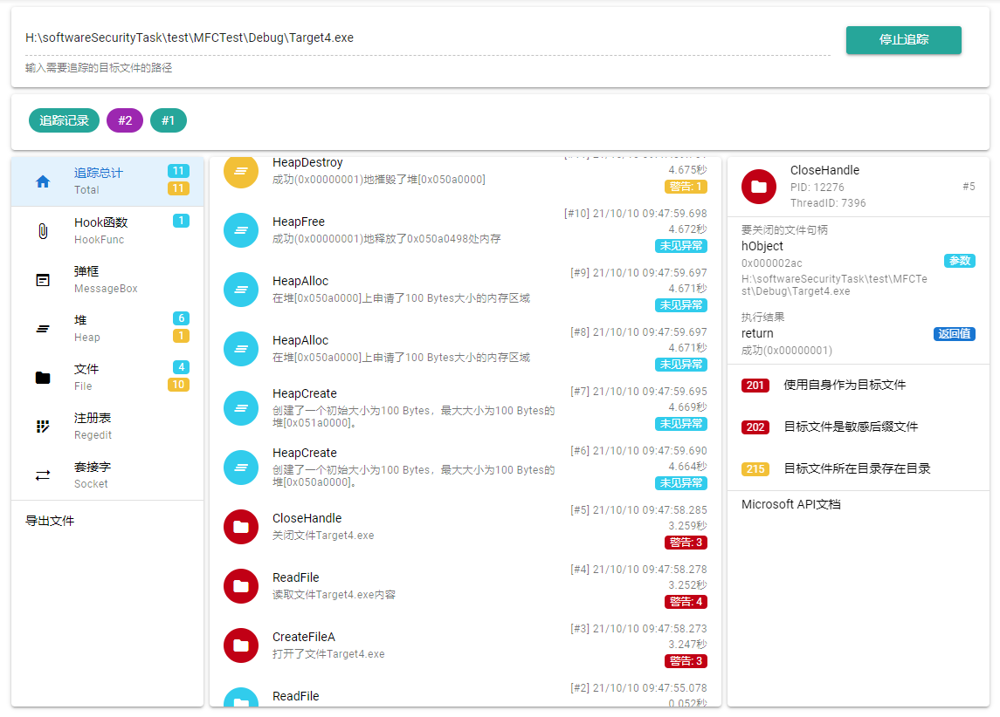

# 软件安全课设

已获得2021年度软件安全课程设计作品赛**一等奖**

## 系统展示



## 捕获的API

```C++
DetourAttach(&(PVOID&)OldMessageBoxA, NewMessageBoxA);
DetourAttach(&(PVOID&)OldHeapCreate, NewHeapCreate);
DetourAttach(&(PVOID&)OldHeapAlloc, NewHeapAlloc);
DetourAttach(&(PVOID&)OldHeapDestroy, NewHeapDestroy);
DetourAttach(&(PVOID&)OldHeapFree, NewHeapFree);
DetourAttach(&(PVOID&)OldCreateFileA, NewCreateFileA);
DetourAttach(&(PVOID&)OldOpenFile, NewOpenFile);
DetourAttach(&(PVOID&)OldReadFile, NewReadFile);
DetourAttach(&(PVOID&)OldWriteFile, NewWriteFile);
DetourAttach(&(PVOID&)_Oldlclose, _Newlclose);
DetourAttach(&(PVOID&)OldCloseHandle, NewCloseHandle);
DetourAttach(&(PVOID&)OldRegCreateKeyExA, NewRegCreateKeyExA);
DetourAttach(&(PVOID&)OldRegOpenKeyExA, NewRegOpenKeyExA);
DetourAttach(&(PVOID&)OldRegQueryValueExA, NewRegQueryValueExA);
DetourAttach(&(PVOID&)OldRegSetValueExA, NewRegSetValueExA);
DetourAttach(&(PVOID&)OldRegCloseKey, NewRegCloseKey);
DetourAttach(&(PVOID&)Oldsocket, Newsocket);
DetourAttach(&(PVOID&)OldWSAStartup, NewWSAStartup);
DetourAttach(&(PVOID&)Oldconnect, Newconnect);
DetourAttach(&(PVOID&)Oldrecv, Newrecv);
DetourAttach(&(PVOID&)Oldsend, Newsend);
DetourAttach(&(PVOID&)Oldclosesocket, Newclosesocket);
DetourAttach(&(PVOID&)OldWSACleanup, NewWSACleanup);
```


## 从源文件简要安装方法

### 注射器、注入dll文件

- 下载并编译Detours库，编译使用32位；
- 下载nlohmann_json_realease库,
- 在根目录下建立lib文件夹，复制Detours库和json库的文件夹到这里。
- 编译dll文件，将编译出的dll文件所在目录地址及其自身绝对地址复制到src/Injector/Injector.cpp文件的26/27行相应处
- 编译注射器，将编译出的exe文件绝对地址复制到public/main.py 40行处

**注：请按照步骤对上述文件编译，若找不到lib文件可以自己手动链接，请使用绝对地址，否则可能会有返回值错误3**

### 目标文件

- 直接使用Visual Studio编译即可，请记住他们的绝对路径。

### 网页文件

- 查看[src/web/README.md](src/web/README.md)，按照其指示制作

### 运行

- 用管理员权限运行public/main.py，访问[localhost:9013](http://localhost:9013)即可。注意受到浏览器限制，只能复制文件绝对路径到输入框中

## 需要自行下载

- Detours-4.0.1
- nlohmann_json_release-3.9.1

项目中还使用了base64.cpp and base64.h的内容
